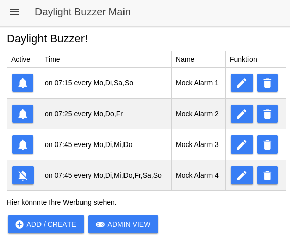

# Warnung
Es wird dringend davon abgeraten diese App in diesem Zustand irgendwo produktiv zu verwenden! 
Sowohl die Security Implementierungen, als auch die Tests und entsprechend die Testabdeckujng sind nicht oder nur marginal vorhanden.  
Verwendung auf eigene Gefahr!

# Daylight Buzzer App - Prototyp
Die Daylight Buzzer App ist im Grunde ein Wecker und besteht aus den folgenden 4 Seiten:
1. Alarmübersicht
2. Neuen Alarm anlegen
3. Bestehenden Alarm editieren
4. Administrationsseite

Der MVP (minimal viable product) besteht aus Anzeigen der Alarme, Triggern eines Alarms zur gegeben Uhrzeit und Tag, Stoppen des Alarms, Triggern des verbundenen IoT Geräts, Anlegen und Editieren von Alarmen, Registrierung, Login und Administration. 
Um die App in den ersten Schritten nicht zu überladen, werden auf Datenbanken und Sicherheitsmechanismen verzichtet und stattdessen werden notwendige Daten entweder in Mocks oder in Dateien abgelegt.  
Insbesondere die Sicherheitsaspekte machen bei einem Prototypen wenig Sinn, da viel Zeit investiert werden muss um es Fail-Safe zu bekommen. Aus diesem Grund werden für die Registrierung und das Login einfache POST-Methoden verwendet, die die Daten im Klartext im Body transpotieren.   
Nachfolgend werden die Seiten und grob die einzelnen Funktionen erläutert. Sofern möglich oder bekannnt werden auch Funktionen genannnt, die nicht im Prototypen vorhanden sind.

## Alarmübersicht

 Bei der Alarmübersicht werden alle vorhandenen Alarme mit Startuhrzeit, Name und Tagen an dem der Alarm aktiv ist angezeigt.  

<i>Info</i>
> Im Prototypen werden die Alarme aus einem Mock-Service geladen und haben stehts die selben Werte, das heißt bei einem Neustart würden neu hinzugefügte Werte und gelöschte Werte überschrieben und der Ursprungszustand wiederherrgestellt. In zukünftigen Versionen wird der Mock-Service durch einen echten Service ausgetauscht und die Daten sollen aus dem lokalen Speicher oder vom Backend bezogen werden.

Durch den Alarm Button an der Spalte _Active_ kann man einen Alarm de- und aktivieren. Zusätzlich kann man einen Alarm durch den Mülleinmer Button löschen. 
Die Buttons *Add/Create* und *Edit* führen zur Seite auf der ein Alarm bearbeitet oder erstellt werden kann.

## Alarm anlegen / editieren

## Aministration
Die Administrationsseite erfordert einen angemeldeten Benutzer. Wenn die Seite von einem Nicht angemeldente Benutzer aufgerufen wird, werden eine Login und ein Registrierung Button angezeigt.

### Registrierung

### Login

### OAuth
Nicht im Prototypen vorhanden.

### Logout
Nicht im Prototypen vorhanden.